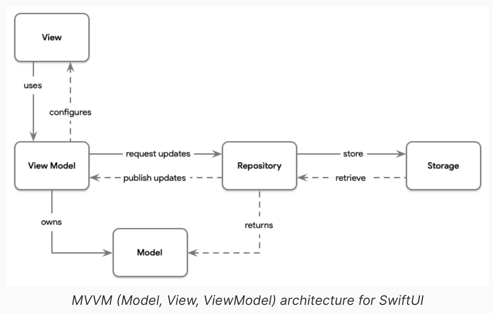

# Stock Checker App

## Setup

This repo uses the `nvie/gitflow` git extension to make it so easy to use the
popular gitflow branching model.

### Gitflow

- To set it up, [follow the instructions here](https://github.com/nvie/gitflow/wiki/Installation)
- Run `git flow init` in the repository directory, applying the following options:

```
$ git flow init
Which branch should be used for bringing forth production releases?
   - main       <-- pick this in the list of branches that appears
Branch name for production releases: [main] main
Which branch should be used for integration of the "next release"?
   - staging      <-- pick this in the list of branches that appears
Branch name for "next release" development: [main] staging
How to name your supporting branch prefixes?
Feature branches? [feature/]      <-- hit enter to pick default
Release branches? [release/]      <-- same here
Hotfix branches? [hotfix/]        <-- same here
Support branches? [support/]      <-- same here
Version tag prefix?               <-- same here
```

## Workflow notes

### Gitflow

Use the following gitflow commands to perform various operations:
| Operation | Command |
| ------------------------------------- | ------------------------------------------ |
| Create a feature branch | `git flow feature start FEATURE_NAME` |
| Push commits on a feature branch | `git flow feature publish FEATURE_NAME` |
| Pull latest changes on feature branch | `git flow feature pull origin FEATURE_NAME` |
| Complete and merge feature branch | `git flow feature finish FEATURE_NAME` |

## App

### Architecture


### How to run locally
1- Clone or download the repo  
2- Open the [/app](./app) directory  
3- This project uses cocoapods, therefore open Stock_Checker.xcworkspace, not .xcodeproj  
4- In Xcode, tap the project, go to Signing & Capabilities, pick your Apple Developer account as a Team. 
5- Make sure Stock_Checker is the selected scheme, select a device or simulator and hit Run (Cmd+R)  
Important to know: this project uses Sign in with Apple, if you don't have a paid Developer account, you won't be able to run the app in an actual device, only the simulator.

### Dependencies used
All necessary dependencies are already installed. You won't need to run pod install or update.
- Firebase/Analytics and /Auth, for authentication with Firebase (user database)
- Resolver, for resolving dependency injection
- Disk, for on-device storage
- iLineChart and SwiftUICharts, for the interactive charts

### Demo video
You can watch a demo video of the app [here](https://youtu.be/nYtJxTl_pqo)

## Contributions for SE_05

Maximilian first used psycopg2 to build the ORM and this was then switched out from Artem with SQLAlchemy. 
We both worked in a call while screensharing the code.
Whenever bigger erros occured we collabrated together to solve them.

Maximilian Hues: 
- psycopg2
- Tests in the ORM
- Created SQL Database
- Refacotring
Artem Miroshnichenko:
- SQLAlchemy
- Flask Server
- Refacotring

The rest of the work was done together in a call while screensharing 
