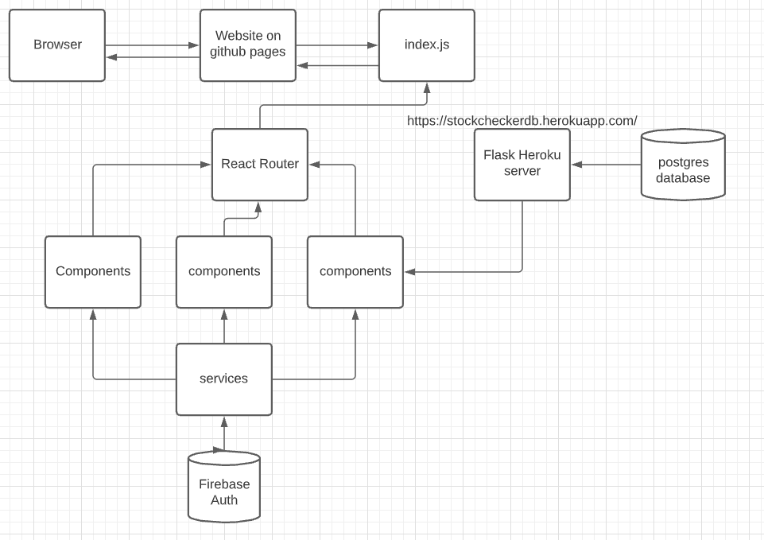

# Stock Checker Website

## How to run locally
1- Clone or download the repo  
2- Open the [/website](./website) directory  
3- Create a .env and add    
```
CHOKIDAR_USEPOLLING=true 


REACT_APP_API_KEY="Firebase Credentials"
REACT_APP_AUTH_DOMAIN="Firebase Credentials"
REACT_APP_DATABASE_URL="Firebase Credentials"
REACT_APP_PROJECT_ID="Firebase Credentials"
REACT_APP_STORAGE_BUCKET="Firebase Credentials"
REACT_APP_MESSAGING_SENDER_ID="Firebase Credentials"
REACT_APP_APP_ID="Firebase Credentials"
REACT_APP_MEASUREMENT_ID="Firebase Credentials"

```  
4- This project uses React, and npm  
5- to run use 
```bash
$ npm start
```
* if that doesn't work, delete the "node_modules" folder in website, and run npm install

## Dependancies
All dependancies are installed locally, no need to install anything
## the Website uses:
Firebase authentication, \
Axios for making get requests \
it relies on data from our made api https://stockcheckerdb.herokuapp.com/
which is intern connected to a postgres DB.

## structure


